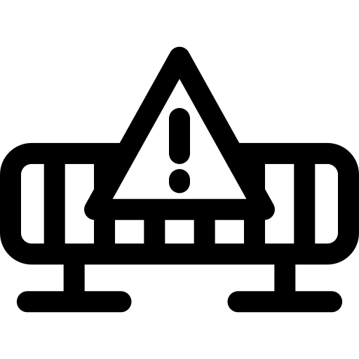

  

# Proyecto: [Nombre del Proyecto]

## Descripción / Description

**Español:**
Este repositorio contiene ejercicios prácticos y apuntes de código para mejorar mis habilidades en [tema o tecnología]. No es un proyecto final, sino una colección de ejemplos y experimentos para aprender y practicar. **El contenido está en desarrollo y puede no estar completamente optimizado o libre de errores.**

**English:**
This repository contains practical exercises and code notes to improve my skills in [topic or technology]. It is not a final project, but rather a collection of examples and experiments for learning and practice. **The content is under development and may not be fully optimized or error-free.**

---

## Tecnologías utilizadas / Technologies Used

**Español:**
- [Lenguaje o tecnología 1]
- [Lenguaje o tecnología 2]
- [Lenguaje o tecnología 3]

**English:**
- [Language or technology 1]
- [Language or technology 2]
- [Language or technology 3]

---

## Estructura del Repositorio / Repository Structure

**Español:**
Cada carpeta o archivo dentro de este repositorio contiene ejercicios o ejemplos relacionados con:

- **Carpeta 1:** Descripción breve del contenido.
- **Carpeta 2:** Descripción breve del contenido.
- **Archivo X:** Código de referencia para [X funcionalidad].

**English:**
Each folder or file in this repository contains exercises or examples related to:

- **Folder 1:** Brief description of the content.
- **Folder 2:** Brief description of the content.
- **File X:** Reference code for [X functionality].

---

## Estado del Proyecto / Project Status

**Español:**
Este proyecto está en constante evolución, ya que sigo aprendiendo y mejorando mis habilidades. El código puede no estar completamente optimizado o terminado, y algunas partes pueden estar en desarrollo activo.

**English:**
This project is constantly evolving as I continue learning and improving my skills. The code may not be fully optimized or finished, and some parts may be under active development.

---

## Notas / Notes

**Español:**
- **Uso personal:** El código aquí compartido es principalmente para mi referencia y experimentación.
- **No apto para producción:** Este repositorio no está destinado a ser utilizado en un entorno de producción ni para otros proyectos sin previa revisión.

**English:**
- **Personal use:** The code shared here is mainly for my own reference and experimentation.
- **Not suitable for production:** This repository is not intended to be used in a production environment or in other projects without prior review.

## Licencia / License

**Español:**
Este repositorio no tiene licencia oficial ya que es únicamente un espacio para aprendizaje.

**English:**
This repository does not have an official license as it is only a learning space.

---

¡Gracias por visitar mi repositorio de ejercicios y apuntes! Estoy en un proceso continuo de aprendizaje, así que cualquier sugerencia o comentario es bienvenido.

---

Thank you for visiting my repository of exercises and notes! I'm in a continuous learning process, so any suggestions or feedback are welcome.