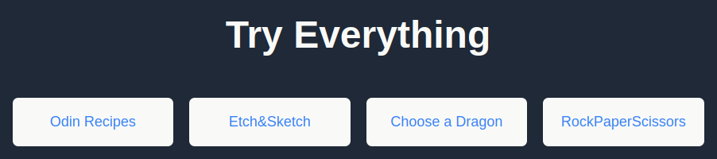
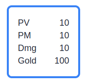

# [Página de pruebas para test con Selenium WebDriver](https://becuber.github.io/page_selenium_test/)

## Descripción
Este repositorio es una pequeña colección de algunos de los primeros ejercicios que se plantean en [Foundations Course](https://www.theodinproject.com/paths/foundations/courses/foundations) de **[The Odin Project](https://www.theodinproject.com/)**.

Son propuestas de código básico en **HTML5**, **CSS3** y **JavaScript**, que se han colocado en el mismo sitio Web para servir de laboratorio de prácticas para un manejo, también básico, de **Selenium WebDriver**.

## Tecnologías utilizadas

## Objetivos
¿Necesitas páginas de prueba para empezar a aprender a manejar tecnologías como **Selenium WebDriver**?

Usa esta [URL](https://becuber.github.io/page_selenium_test/) para familiarizarte con un DOM básico.

## Estado del Proyecto
El sitio web contiene:
- **Home**: Página de inicio, desde donde se puede acceder a los 4 ejercicios que se describen a continuación. Todos ellos tienen un botón en el encabezado que vuelve a esta página.
- **Odin Recipes**: Ejercicio basado en la propuesta [**Project: Recipes**](https://www.theodinproject.com/lessons/foundations-recipes).
- **Etch&Sketch**: Ejercicio basado en la propuesta [**Project: Etch-a-Sketch**](https://www.theodinproject.com/lessons/foundations-etch-a-sketch).
- **Choose a Dragon**: Ejercicio libre que busca tener disponibles distintos widgets de formulario imitando una selección de personaje.
- **RockPaperScissors**: Ejercicio basado en la propuesta [**Project: Rock Paper Scissors**](https://www.theodinproject.com/lessons/foundations-rock-paper-scissors).
### [Home](https://becuber.github.io/page_selenium_test/index.html)
La página anima a interactuar con los elementos del sitio web.
Contiene únicamente 4 botones que llevan a los demás ejercicios.

>**Idea de test:**
>
>*¿Los links en los botones llevan a donde deben?*
### [Odin Recipes](https://becuber.github.io/page_selenium_test/exercises/odin_recipes/odin_recipes.html)

Son 4 páginas, la presentación, con 3 enlaces a las recetas, y las recetas, que contienen botones de navegación entre ellas.

>**Idea de test:**
>
>*¿Es correcta la navegación entre las recetas?*
>
>*¿Aparecen los botones correctos para navegar entre ellas en orden?*
### [Etch&Sketch](https://becuber.github.io/page_selenium_test/exercises/etch_sketch/etch_sketch.html)

Muestra un panel dividido en cuadrados que responden al movimiento del ratón cambiando de color a un tono más oscuro.
Cada cuadrado responde al evento de ratón hasta 10 veces, siendo cada vez más oscuro.
El panel izquierdo permite elegir la cantidad de cuadrados por lado que se muestran y el color.

>**Idea de test:**
>
>*¿Existen tantos cuadrados como el número seleccionado por el usuario?*
### [Choose a Dragon](https://becuber.github.io/page_selenium_test/exercises/choose_a_dragon/choose_a_dragon.html)

Imita una ficha de personaje donde puedes seleccionar el color del dragón, su nombre, tres atributos (CON, MAG y STR) y comprarle algún item.
Esta página contiene widgets tipo *radio button*, *slider*, *input-text* y *selector*.

Los valores por defecto para tu dragón son:

Los sliders modifican los valores por defecto de la siguiente manera:
- **CON**: cada punto sube +10 a PV
- **MAG**: cada punto sube +10 a PM
- **STR**: cada punto sube +10 a Dmg

Entre los tres atributos definidos con sliders no se puede sumar más de **8** puntos.

Los **items** disponibles en el *selector* cuestan **20 Gold**.
Cada item sube **+5** a uno de los tres atributos finales (**PV**, **PM** o **Dmg**)
Pueden elegirse **hasta 3 items** que se verán reflejados en **Equipment**.

Los items pueden devolverse con este botón:

Se devolverá **el último item adquirido** y se recuperarán **15 Gold**.

Con el botón **Clear** se recuperan todos los valores por defecto en la ficha.

>**Idea de test:**
>
>*¿Es '8' la puntuación máxima que permiten los sliders?*
>
>*¿Cada punto asignado a un slider refleja el valor correcto (+10) en el atributo final que le corresponde?*
>
>*¿Los items seleccionados aparecen correctamente en el campo 'Equipment'?*
>
>*¿Los items seleccionados son un máximo de '3' y suman '+5' uno de los atributos finales?*
>
>*¿Los items se devuelven correctamente (desaparece de 'Equipment', se suma +15 a Gold y se resta -5 al atributo que se había sumado)?*
>
>*¿Al interactuar con 'Clear' se resetean todos los valores?*
### [RockPaperScissors](https://becuber.github.io/page_selenium_test/exercises/rock_paper_scissors/rock_paper_scissors.html)

Tiene tres botones, uno por cada **arma**.
El que elijas aparecerá en el cuadro **Player** y al mismo tiempo aparecerá otro arma en el cuadro **Computer** que se elegirá de forma aleatoria.
El programa sumará **+1 punto** (a Player o Computer) al que gane según las reglas tradicionales.
Si existe empate, no sumará nada.
El primero que llegue a **5 puntos** se declarará vencedor.
Se resetean los puntos únicamente cuando se termina una partida y se selecciona cualquier nueva arma.

>**Idea de test:**
>
>*¿Se suman correctamente los puntos?*
>
>*¿Se declara al ganador correctamente?*
>
>*¿Están apareciendo las tres opciones con una probabilidad similar para 'Computer'?*

## Mejoras previstas
- Se pretende orientar el sitio Web para que la interacción con **Selenium WebDriver** y la propuesta de casos de prueba sean guiados.
- Para **Choose a Dragon** se quiere utilizar el botón **Send** para iniciar una miniaventura.
- Se pretende añadir **más tipos de widget** y alguna estructura de **tabla** para poder interactuar desde **Selenium WebDriver**.

## Notas
- **Uso personal:** El código aquí compartido es principalmente para aprendizaje y experimentación.
- **No apto para producción:** Este repositorio no está destinado a ser utilizado en un entorno de producción ni para otros proyectos sin previa revisión.

---
¡Gracias por visitar este sitio Web! Estoy en un proceso continuo de aprendizaje, así que cualquier sugerencia o comentario es bienvenido.